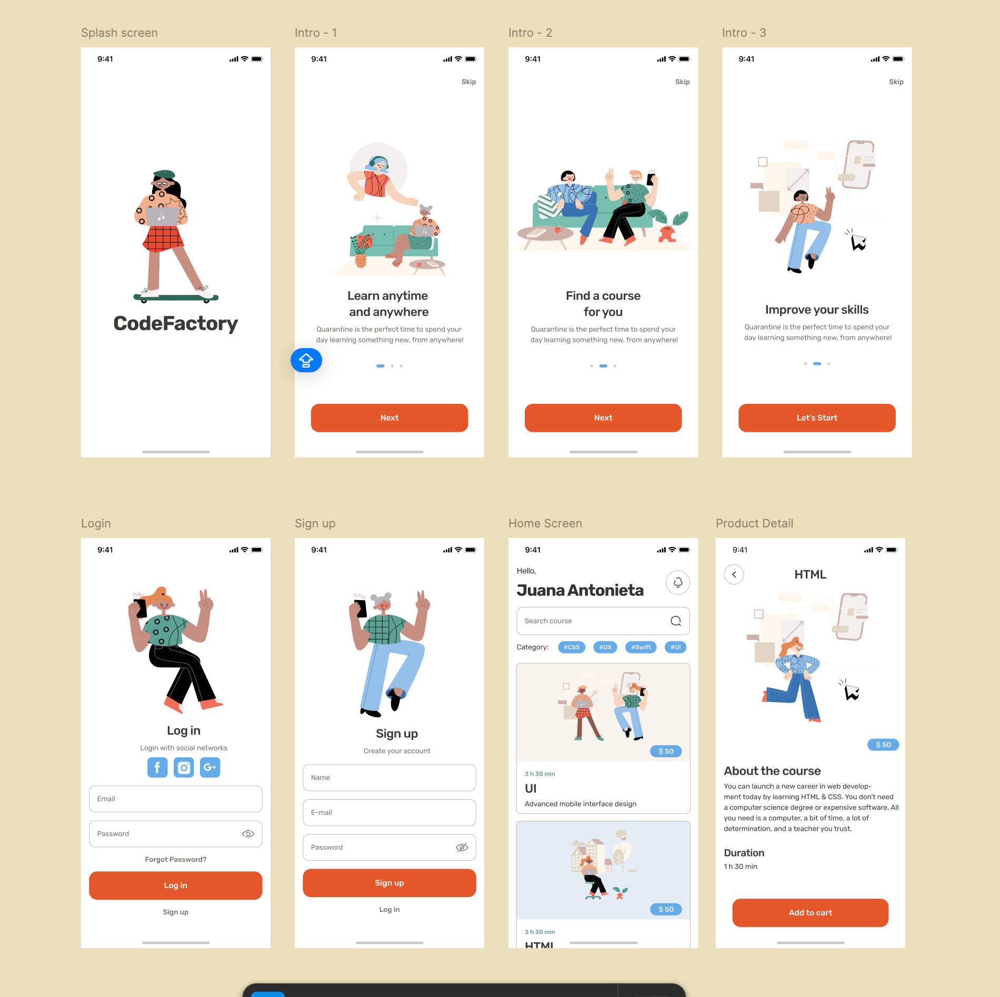

<<<<<<< HEAD
Learning App UI 🎓 📱

Introduction

In this project, you will design and develop a Learning App UI in
Flutter. This app will allow users to explore online courses, sign up,
and view course details. The main focus is on creating an engaging,
well-structured user interface with multiple screens.

📱 Core Screens to Implement:

✅ Splash Screen – Displays
the app logo.

✅ Onboarding Screens – Three
intro screens guiding users about the app.  
✅ Login & Sign-Up Screens – Allow users to register and log in.

✅ Home Screen – Displays user info, course categories, and available
courses.

✅ Course Details Screen –
Shows course description, price, and an "Add to Cart" button.

🎨 Figma UI:

https://www.figma.com/design/xlEI4XXk7ZRzTRxfLc46fE/Course-EdTech-Mobile-App-(Community)?node-id=0-1&p=f&t=FgLZdcCvSivg3qjR-0

https://www.figma.com/design/xlEI4XXk7ZRzTRxfLc46fE/Course-EdTech-Mobile-App-(Community)?node-id=0-1&p=f&t=FgLZdcCvSivg3qjR-0

💻 GitHub Submission
Guidelines:  
- Your README.md should include:

> \- Project description  
> - Setup instructions
>
> \- Screenshots of your app

⏰ Deadline:

Your project must be submitted by 1/5/2025 , before 10:00 AM.

✨ Reminder:

"Learning never stops! Build
great UI, and let your app inspire others." 🚀
=======
# apr30

A new Flutter project.

## Getting Started

This project is a starting point for a Flutter application.

A few resources to get you started if this is your first Flutter project:

- [Lab: Write your first Flutter app](https://docs.flutter.dev/get-started/codelab)
- [Cookbook: Useful Flutter samples](https://docs.flutter.dev/cookbook)

For help getting started with Flutter development, view the
[online documentation](https://docs.flutter.dev/), which offers tutorials,
samples, guidance on mobile development, and a full API reference.
>>>>>>> 3124ce2 (First commit)
