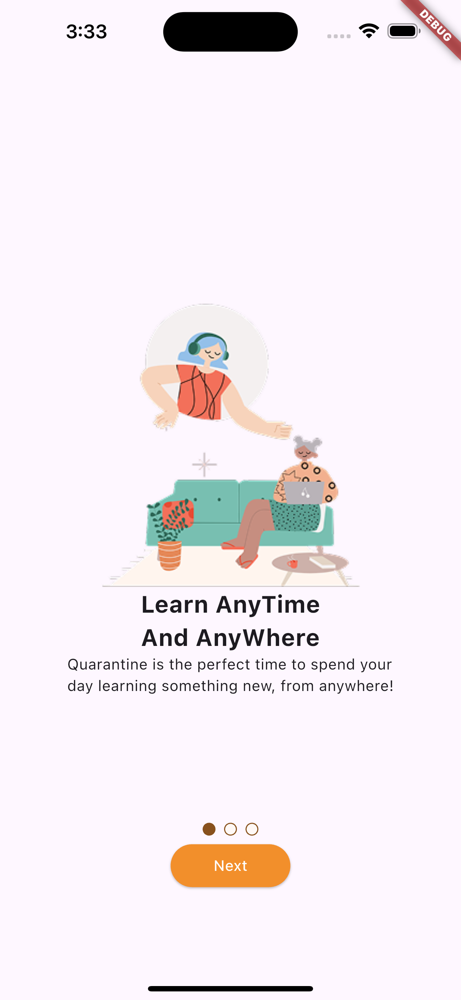
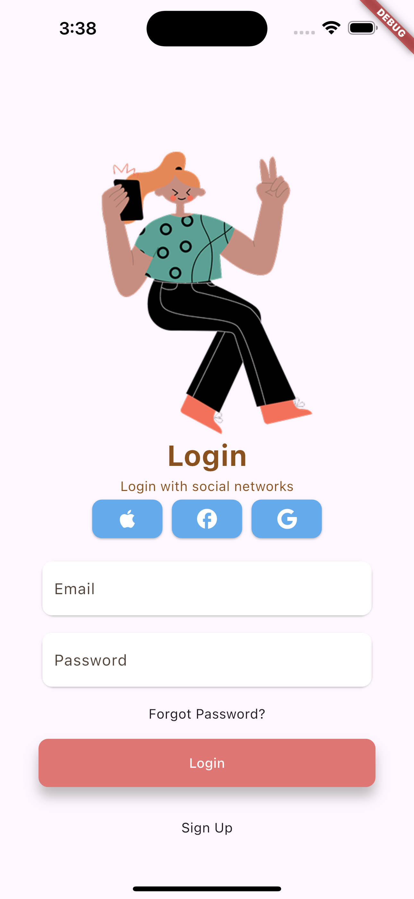
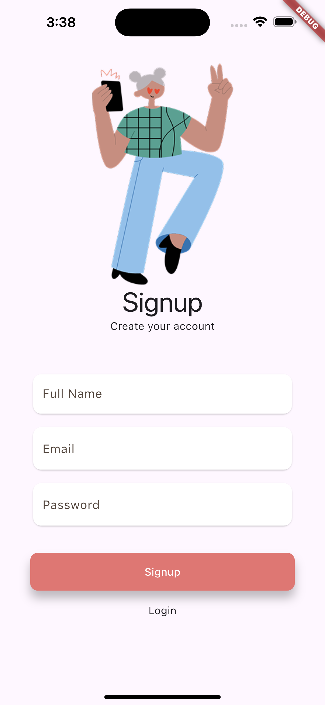
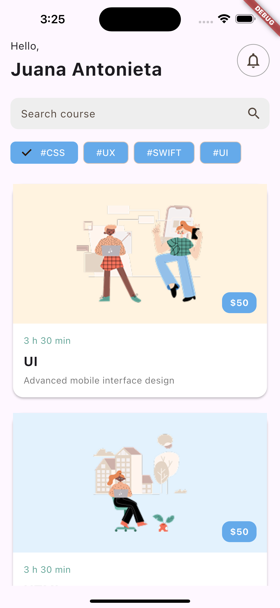

# Learning App UI

A beautifully designed Flutter learning app UI that offers an engaging onboarding experience, secure authentication, and an intuitive interface to browse course content.

## Screenshots

### Splash Screen  


### Onboarding Tabs  


### Login Screen  


### Signup Screen  


### Home Screen  


### Course Details Screen  


> _Note: Replace the placeholder paths above with actual image paths once you add screenshots._

## Features

- Splash screen with logo or branding.
- Onboarding screen with three informative tabs.
- Login screen with form validation (email format).
- Signup screen for new user registration.
- Home screen displaying available courses.
- Course details screen showing in-depth information.

## Tech Stack

- Flutter (latest stable version)
- Dart
- (Optional) Firebase (for authentication or backend integration)
- (Optional) Bloc / Riverpod (for state management)

## Installation

1. Clone the repository:
   ```bash
   git clone https://github.com/your-username/your-repo-name.git
2. Navigate to the project directory:
    ```bash
    cd your-repo-name
3. Install dependencies:
    ```bash
    flutter pub get
4. Run the app:
    ```bash
    flutter run
## How to use:
- Launch the app to start at the splash screen.

- Navigate through the onboarding flow.

- Log in with a valid email or go sign up to bypass it.

- Browse the home screen for available courses.

- Tap a course to view its details.
## Author
- Solaiman AlDokhail
