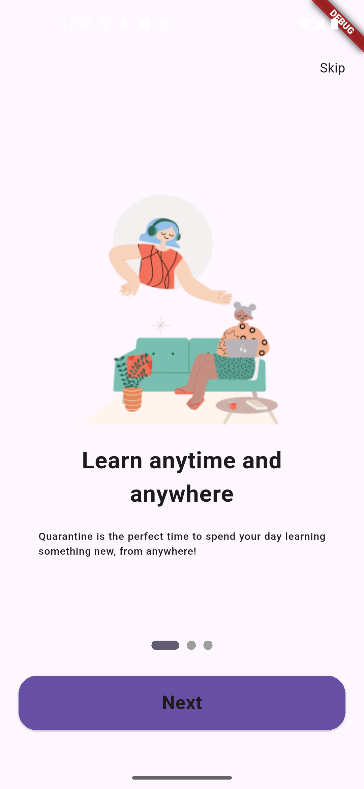
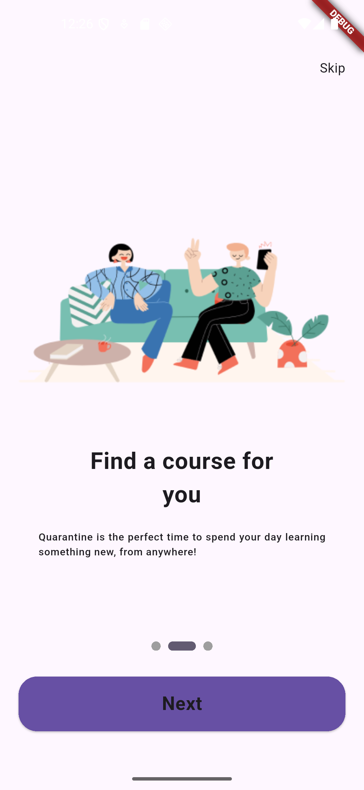
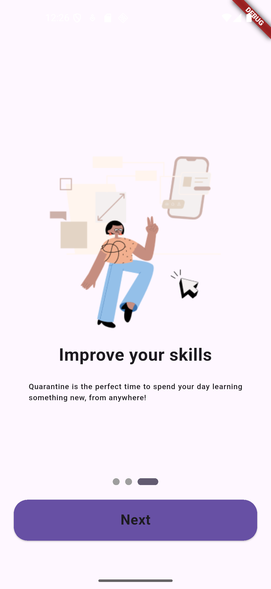
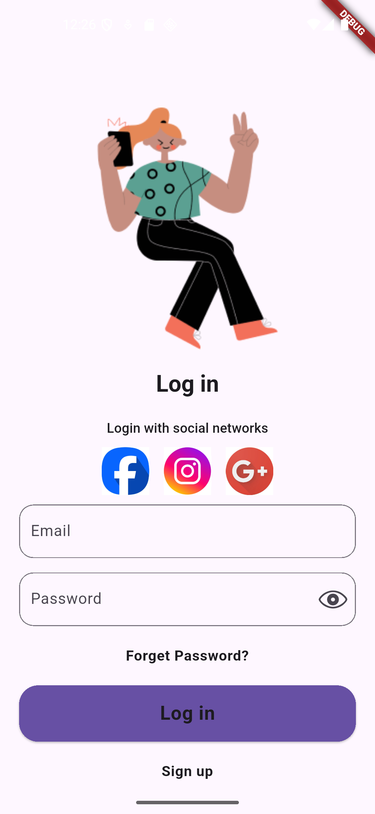
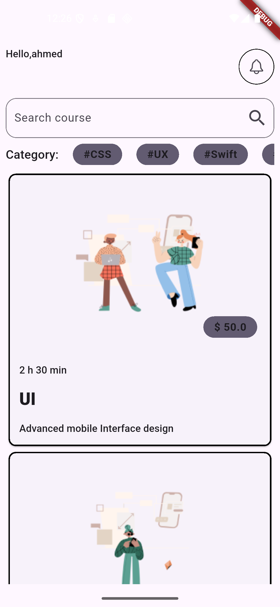
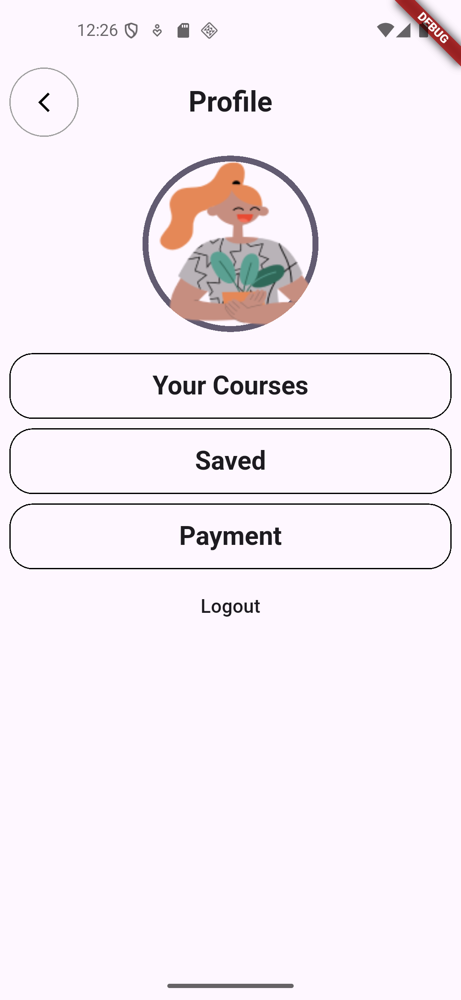

# learn App UI

A beautiful Flutter app for learn courses .

---

## Screenshots










---

##  Features

- Browse coursess.
- Add courses to the cart.
- Search bar and filter options.
- Category buttons for easy navigation.
- Smooth and responsive UI design.

---

## Tech Stack

- Flutter
- Dart

---

## Installation

1. Clone the repository:

```bash
git clone https://github.com/Ahmed-Almansour99/Learning-App-UI.git


cd Learning-App-UI

flutter pub get

flutter run
```


## How to Use
Launch the app.

Browse through the list of popular courses.

Tap on the "Add to Cart" button to add courses to your cart.

Use the search bar to find courses quickly.

Navigate categories using category buttons.

## Author

github : Ahmed-Almansour99
 

