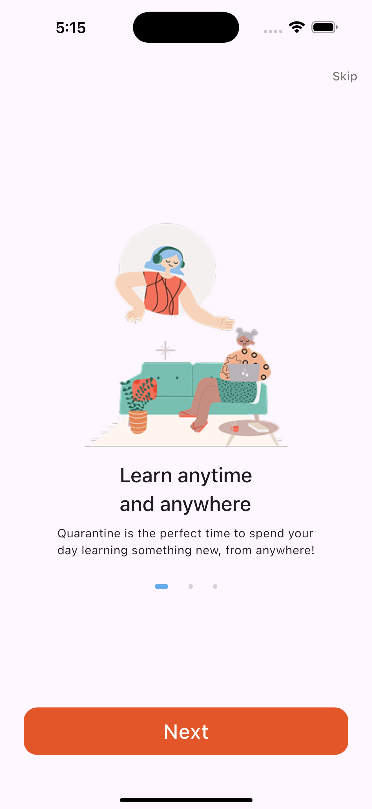

# Learning-App-UI
Learning-App-UI is a sleek and intuitive learning app that offers users a seamless experience exploring and browsing online courses. The app delivers a well-structured user interface across multiple screens, ensuring easy navigation throughout its various sections. The focus of the app is purely on the user interface, without incorporating any functionalities.


# Getting Started
### Prerequisites

Flutter SDK 

A code editor (such as VS Code or Android Studio)

### Installation
1. Clone the repository:

   ```
   git clone https://github.com/2Mhd6/Learning-App-UI.git
   ```

2. Navigate to the project directory:

   ```
   cd Learning-App-UI
   ```
   
3. Install dependencies:

   ```
   flutter pub get
   ```

4. Run the app:

   ```
   flutter run
   ```

## Output

**Splash Screen**


**Onboarding Screen**

<p float="left">



</p>

**Log in Screen**


**Sign up Screen**


**Home Screen**


**Course Details Screen**


## Languages & Frameworks

**Dart**

**Flutter**

## Created By

[**Mohammed S. Alshammari**](https://www.linkedin.com/in/mohammedsalshammari/)

