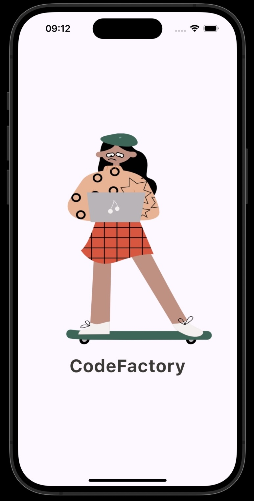
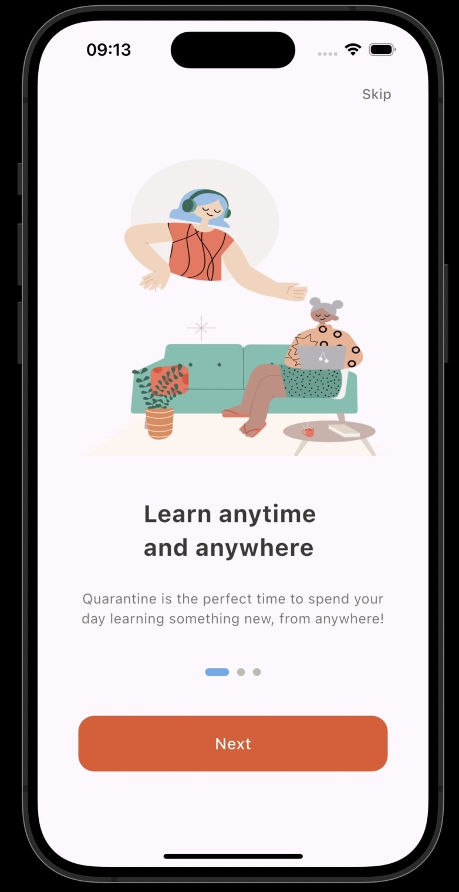
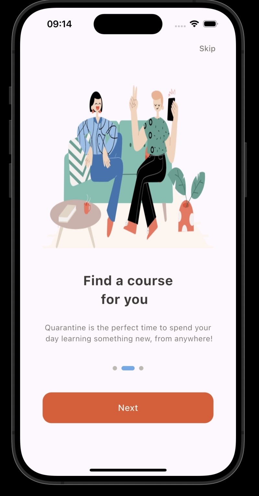
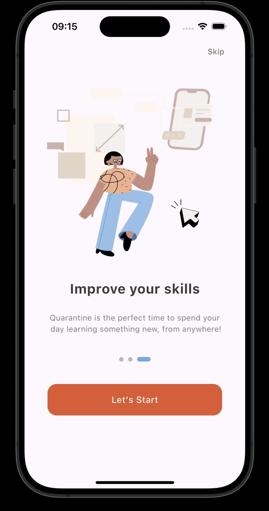
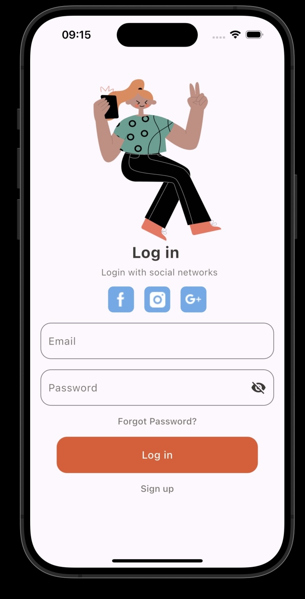
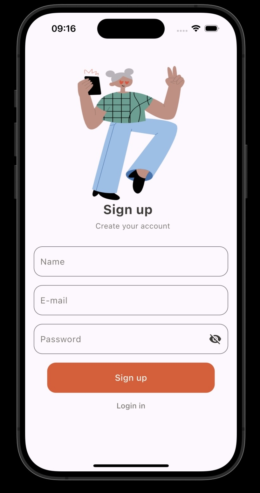
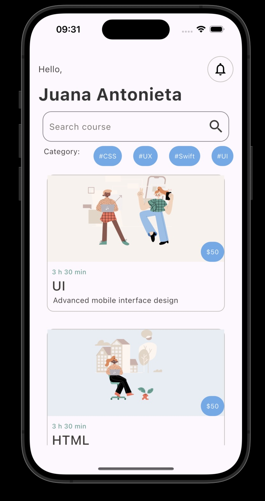
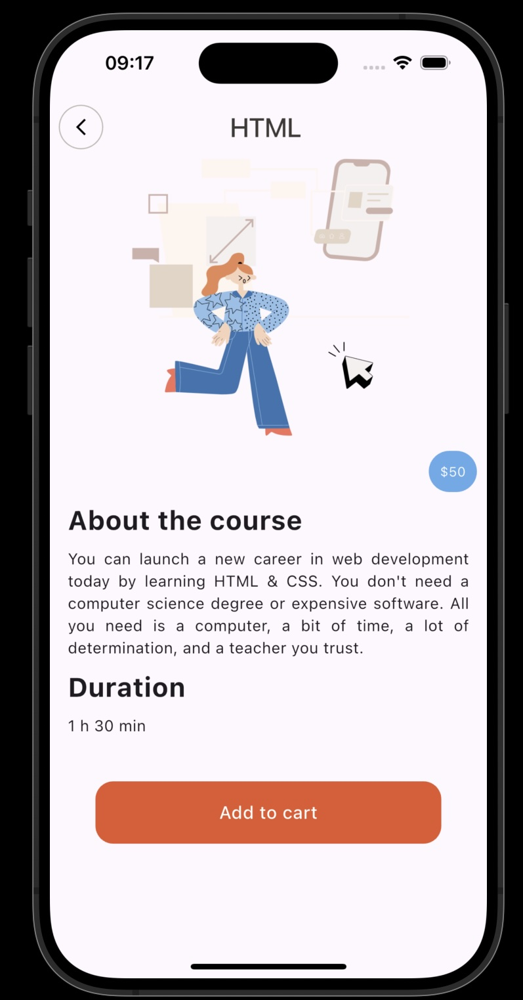

Learning App UI 🎓 📱# 📚 Learning App UI – Flutter Project

A beautifully designed Flutter application that provides an interactive user interface for an online learning platform. Users can explore courses, view details, sign up, and log in seamlessly.

## 🔄 Forked From
This project is forked from the original repository: [Learning App UI](https://github.com/Flutter-13Aprill/Learning-App-UI.git)


## 📸 Screenshots

### 🟢 App Preview (GIF)


---

### Splash Screen


### Onboarding Screens




### Authentication Screens



###  Home Screen


### Course Details


## ✨ Features

-  Splash & Onboarding Screens
-  User Login and Registration
-  Home screen showing courses and categories
-  Detailed Course View with pricing
-  Add to cart functionality (UI only)
-  Clean, responsive and modern UI inspired by Figma design

## 🧰 Tech Stack

- **Flutter** (latest stable)
- **Dart**

## 🚀 Installation
1. Clone the repository:
   ```bash
   git clone https://github.com/Norah200/Learning-App-UI.git
   
Navigate to the project directory:

Install dependencies:
flutter pub get

Run the app:
flutter run
🧪 How to Use

Open the app.
Swipe through the onboarding screens.
Sign up or log in.
Browse available courses.
View detailed course information.
Add course to cart (UI action).

👤 Author
 (GitHub: [Norah200](https://github.com/Norah200))
